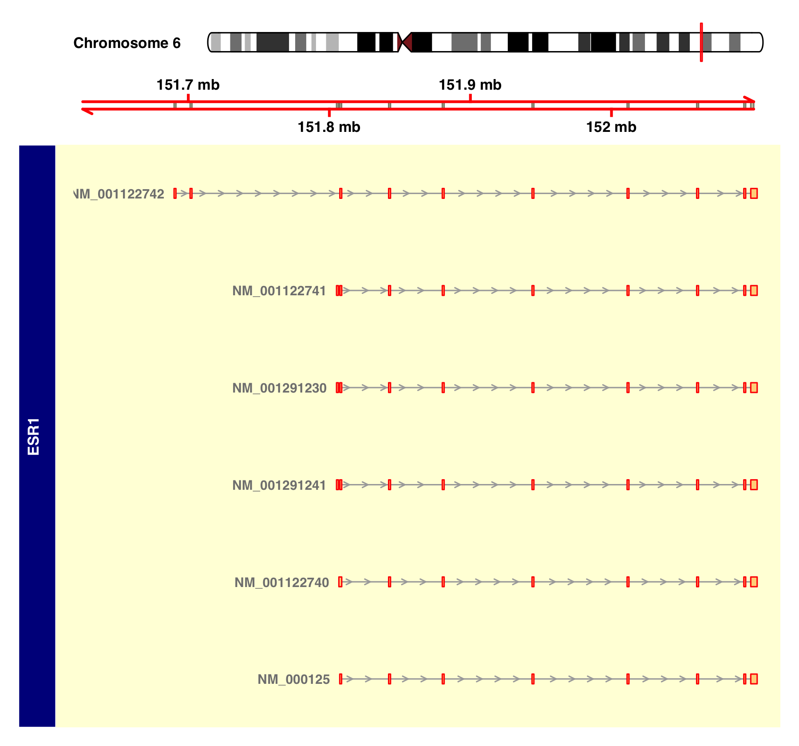

# genomeGraphic
In terms of biologists need to draw the genome region graph sometimes, here is a simple script for drawing beautiful transcripts.
This is depandant on R packages called <a href='https://bioconductor.org/packages/release/bioc/html/Gviz.html'>Gviz</a> and <a href='https://bioconductor.org/packages/release/bioc/html/GenomicRanges.html'>GenomicRanges</a>.

The main script is written in draw.R.
The input or required file is genome annotation file.
```{r setup, include=FALSE}
hg38 = read.csv('./db/hg38.refGene')
```

There are two functions:
* 1. draw a transcript as a figure.
```{r}
format1(gene, mat)
```
result figure:


* 2. draw a gene as a figure including all the transcripts.
```{r}
format2(gene, mat)
```
result figure:


* 3. draw genome track using script in IGV_R folder, you should prepare bw file of ChIP-seq or other NGS data, and genomic intervals in bed file
